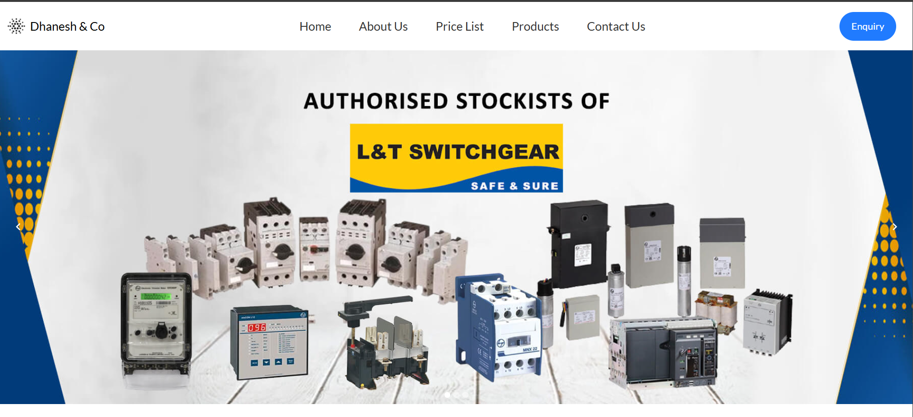
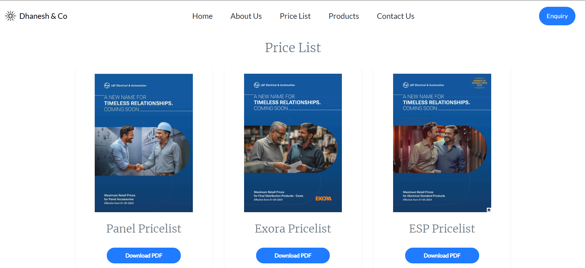
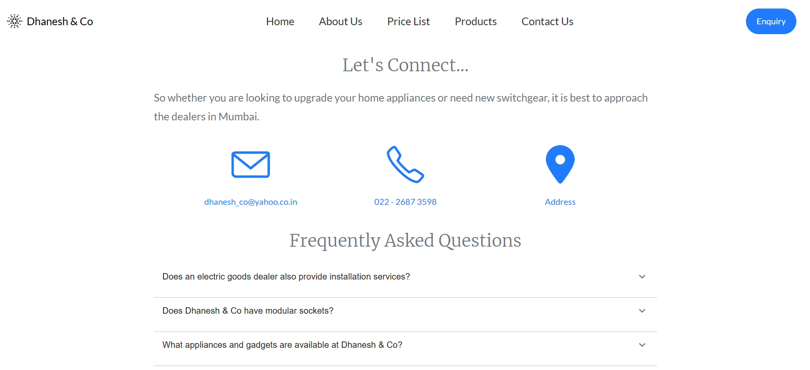
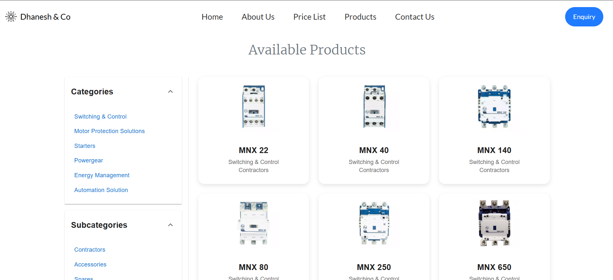
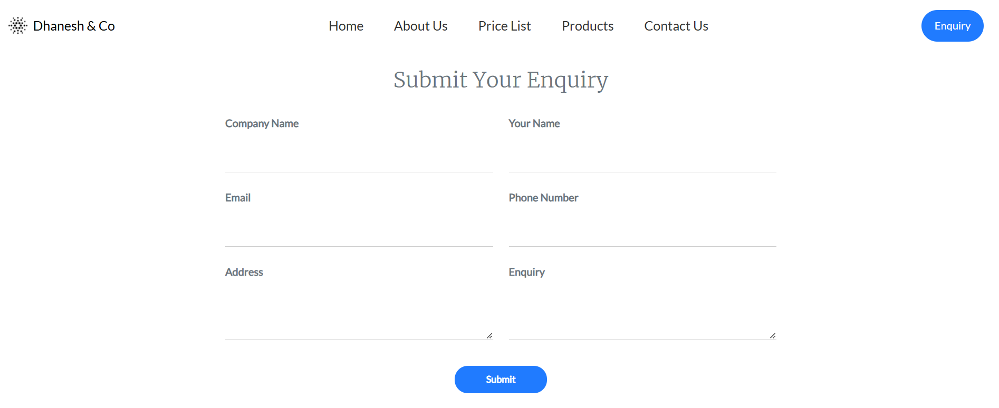

# Business Website

This is a professional website built to help businesses transition online. The site features a clean, responsive design with dynamic content management. 

## Features

- **Responsive Design**: Optimized for mobile, tablet, and desktop devices.
- **Dynamic Content Management**: Powered by MySQL for easy management of business data.
- **Fast Performance**: Utilizes Next.js for fast rendering and optimal user experience.

## Pages

- **Home**: The homepage showcasing the business with key information.
- **About**: Information about the company, its story, and mission.
- **Services**: A list of services offered by the business.
- **Contact**: Information of business contact details.
- **Enquiry**: A enquiry form using emailjs.

## Setup Instructions

1. **Clone the repository**:
2. **Install the dependencies using "npm install"**:
3. **Set up MySQL**:
4. **Start the development server by "npm run dev"**:
Visit `http://localhost:3000` to view the website locally.

## Live Version

The website is live at: [dhaneshnco.in](http://dhaneshnco.in)

## Snapshots  
  
  

  

  

  

  

